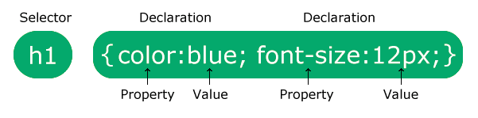
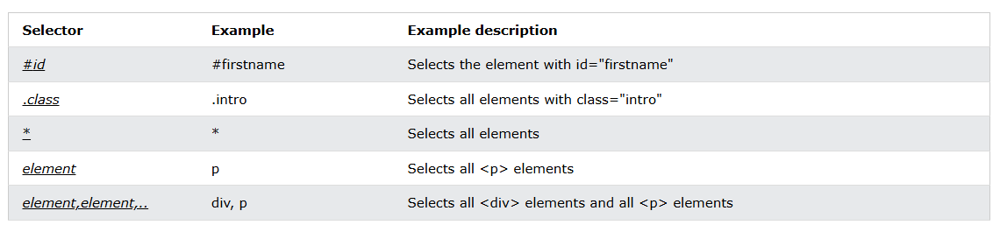
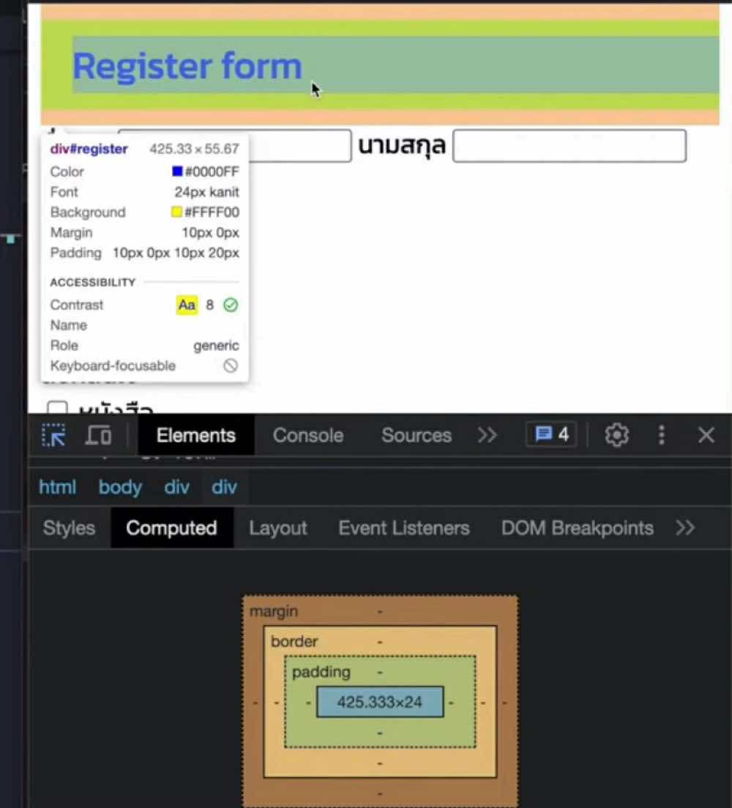
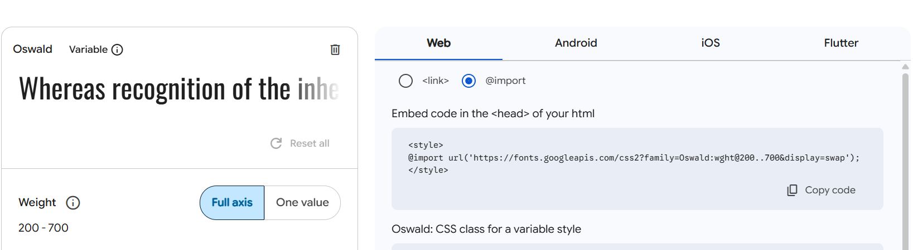
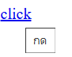
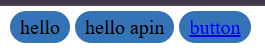
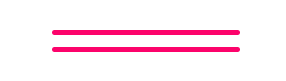
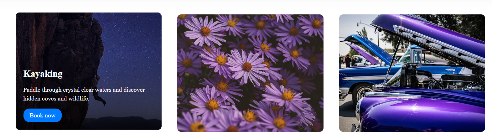
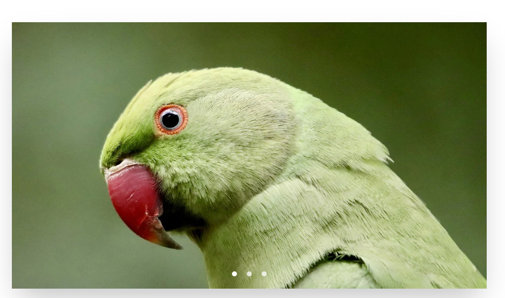

# Reference From
Document from: [Doc](https://www.w3schools.com/CSS/default.asp)<br>
Document from: [Mikelopster](https://youtu.be/KCYxFXIAn_4?si=SOL-E_LZ-FCaFnKX)<br>

<hr>

## 1.กลุ่มการจัดตำแหน่งและเลย์เอาต์ (Layout and Positioning)
การจัดตำแหน่ง (Positioning):
* position: ใช้ในการกำหนดการจัดต าแหน่งขององค์ประกอบ เช่น static, relative, absolute, fixed, และ sticky
การจัดเลย์เอาต์:
* display: ใช้ในการกำหนดลักษณะการแสดงผลขององค์ประกอบ เช่น block, inline,inline-block, flex, grid
* float: ใช้ในการท าให้องค์ประกอบลอยอยู่ทางซ้ายหรือขวา
* clear: ใช้ในการเคลียร์การลอยขององค์ประกอบ
* flex และ grid: ฟีเจอร์ใหม่ที่ช่วยในการจัดการการวางเลย์เอาต์ที่ซับซ้อน

## 2. กลุ่มการจัดรูปแบบข้อความ (Text Formatting)
การตั้งค่าฟอนต์:
* font-family: ใช้ในการกำหนดฟอนต์ของข้อความ
* font-size: กำหนดขนาดตัวอักษร
* font-weight: กำหนดความหนาของตัวอักษร (bold, normal)
* font-style: กำหนดสไตล์ของฟอนต์ (normal, italic)
การจัดรูปแบบข้อความ:
* text-align: กำหนดการจัดต าแหน่งของข้อความ (left, right, center, justify)
* text-transform: ใช้ในการปรับแต่งการแสดงผลของตัวอักษร (uppercase, lowercase)
* text-decoration: กำหนดลักษณะการตกแต่งข้อความ เช่น ขีดเส้นใต้ (underline), ขีด
กลาง (line-through)

## 3. กลุ่มการจัดการสีและพื้นหลัง (Color and Background)
การจัดการสี:
* color: กำหนดสีของข้อความ
* background-color: กำหนดสีพื้นหลัง
* border-color: กำหนดสีของขอบ
การจัดการพื้นหลัง:
* background-image: ใช้ในการใส่ภาพพื้นหลัง
* background-position: กำหนดตำแหน่งของภาพพื้นหลัง
* background-size: กำหนดขนาดของภาพพื้นหลัง
* background-repeat: กำหนดการทำซ้ำภาพพื้นหลัง

## 4. กลุ่มการเพิ่มกรอบและการจัดระยะห่าง (Borders and Spacing)
กรอบ (Borders):
* border: กำหนดกรอบรอบองค์ประกอบ เช่น ขนาด, รูปแบบ, และสีของกรอบ
* border-radius: ใช้ในการสร้างมุมโค้งให้กับกรอบ
ช่องว่าง (Spacing):
* margin: กำหนดช่องว่างภายนอกองค์ประกอบ
* padding: กำหนดช่องว่างภายในองค์ประกอบ

## 5. กลุ่มการใช้งานกราฟิก (Graphics)
การจัดการภาพและกราฟิก:
* box-shadow: ใช้ในการเพิ่มเงาให้กับองค์ประกอบ
* text-shadow: ใช้ในการเพิ่มเงาให้กับข้อความ
* linear-gradient, radial-gradient: ใช้ในการสร้างการไล่ระดับสีเป็นพื้นหลัง

## 6. กลุ่มการแอนิเมชันและการเปลี่ยนแปลง (Animations and Transitions)
การเปลี่ยนแปลง (Transitions):
* transition: ใช้ในการเปลี่ยนแปลงสไตล์ขององค์ประกอบเมื่อมีการโต้ตอบ เช่น การ
เปลี่ยนสีเมื่อเลื่อนเมาส์
* transform ใช้ในการหมุนหรือปรับแต่งการแสดงผลขององค์ประกอบ
แอนิเมชัน (Animations):
* @keyframes: กำหนดลำดับของแอนิเมชัน
* animation: ใช้ในการกำหนดลักษณะของแอนิเมชัน เช่น ความยาวเวลา, การทำงานที่
เสร็จสมบูรณ์, และการเล่นซ้ำ

## CSS Syntax
Syntax ของ CSS3 มีรูปแบบที่ใช้ในการกำหนดสไตล์ขององค์ประกอบใน HTML โดยทั่วไปจะประกอบไปด้วย 3 ส่วนหลัก ๆ <br>ได้แก่ ตัวเลือก (Selector), คุณสมบัติ (Property), และ ค่า (Value)<br>
<br>
รูปแบบทั่วไปของ CSS
<pre>
p {
  color: red;
  text-align: center;
}
</pre>
1. P (ตัวเลือก): คือชื่อขององค์ประกอบหรือกลุ่มขององค์ประกอบที่คุณต้องการจะปรับแต่ง
สไตล์ เช่น body, h1, .class-name, #id-name
2. color,text-align (คุณสมบัติ): คือคุณสมบัติที่คุณต้องการจะเปลี่ยนแปลง เช่น color, font-size,
margin, background-color
3. red,center (ค่า): คือค่าที่คุณต้องการจะก าหนดให้กับคุณสมบัตินั้น ๆ เช่น red, 16px, 20px, #ffffff



### Three Ways to Insert CSS
* <b>Inline CSS (การใช้ CSS ภายในแท็ก HTML โดยตรงใน `<body>`) </b> 
* <b>Internal CSS (การใช้CSS ภายในแท็ก `<style>` ใน `<head>`) </b> 
* <b>External CSS (การใช้ไฟล์ CSS ภายนอก ใน `<head>` )</b>:`<link rel="stylesheet" type="text/css" href="styles.css">`


<hr>

# CSS seletor เราจะแต่งอะไรให้ select เข้าไป

 วิธี select มี 3 แบบ

* เข้าถึง tag(DOM)
        **ตัวอย่าง** เข้าถึง tag ```body```
    ```css
     body {
            font-family: 'Segoe UI', Tahoma, Geneva, Verdana, sans-serif;
            background: linear-gradient(135deg, #667eea 0%, #764ba2 100%);
            min-height: 100vh;
            padding: 40px 20px;
        }
    ```
* เข้าถึง id
        **ตัวอย่าง** เข้าถึง ```#item```
        ```css
        #item{
            background: #eee;
        }
        ```
* เข้าถึง class 
        **ตัวอย่าง** เข้าถึง ```.container```
        ```css
            .container {
            max-width: 1200px;
            margin: 0 auto;
        }
        ```

## 2. ```<div>``` vs ```<span>```
* ```<div>``` จะขึ้นบรรทัดใหม่ นิยมใช้เป็นเหมือนกล่องไว้ครบเพื่อแต่ง style
* ```<span>``` จะไม่ขึ้นบรรทัดใหม่ ส่วนตัวเอาไว้ใช้คู่กับ ```<p>``` การณีอยากแต่งแค่บางส่วนของประโยค
    **ตัวอย่าง**
    ```html
    <p>Copyright &copy;2025 Designed by
        <span><a href="#header">Mister S</a></span>
    </p>
    ```
## 3. ```margin``` vs ```padding```



จะเห็นว่าทั้ง ```margin``` และ ```padding``` เอาไว้ใช้เพิ่ม space ให้กล่อง
* margin -> space นอกกล่อง ใช้เลื่อนทั้งกล่อง จะกำหนดแยกหรือรวมในบรรทัดเดียวก็ได้

```css
/*     บนทล่าง  ซ้ายขวา*/
margin: 10px   5px;
```
* padding -> space ในกล่อง สามารถกำหนดได้เหมือน margin

## 4. position
* static -> เป็น defualt
* relative -> ผลักออก
* absolute -> กำหนดตำแหน่งทั้งหน้าจอ
* fixed -> ตำแหน่งจะไม่เปลี่นแม้ scroll
* sticky -> เหมือน fixed แต่จะตาม scroll เฉพาะใน container ของมัน

## 5. เปรียบเทียบขนาด font

| HTML Tag | ขนาด (em/rem) | ขนาด (px) โดยประมาณ |
| -------- | ------------- | ------------------- |
| `<h1>`   | 2.0rem        | 32px                |
| `<h2>`   | 1.5rem        | 24px                |
| `<h3>`   | 1.17rem       | \~18.72px           |
| `<h4>`   | 1.0rem        | 16px                |
| `<h5>`   | 0.83rem       | \~13.28px           |
| `<h6>`   | 0.67rem       | \~10.72px           |

## 6. หน่วยในในโลก CSS
    * % -> % ของกล่อง(parent)
    * vw(width), vh(height) -> ขนาดเป็นไปตามหน้าจอ
    * em -> ขาดเป็น x เท่าของแม่(สมมุติแม่ = 12px) เช่น 2em = 12*2 = 24px
    * rem -> ขาดเป็น x เท่าของ root(default = 16px) เช่น 3rem = 16*3 = 48px
(Pixels) *px* – หน่วยคงที่ ความหมาย:
* เป็นหน่วยที่ใช้กันมากที่สุด กาหนดขนาดแบบตายตัว (Fixed Size)
* 1 px = 1 พิกเซลของหน้าจอ

(Percentage) *%* – อ้างอิงจากขนาดของพ่อ (Parent) ความหมาย:
* ค่าจะขึ้นอยู่กับขนาดขององค์ประกอบพ่อ (Parent)
* เหมาะสาหรับทาให้ขนาดยืดหยุ่น (Flexible)

*em* – อ้างอิงจากขนาดตัวอักษรของพ่อ (Parent) ความหมาย:
* 1 em = ขนาดของ font-size ของ Parent
* ถ้าไม่มีการกาหนด Parent, ค่าจะเท่ากับ font-size ของ `<html>` (ปกติคือ 16px)

*rem* – อ้างอิงจากขนาดตัวอักษรของ html (Root Element) ความหมาย:
* 1 rem = ขนาด font-size ของ <html> (ปกติคือ 16px)
* ไม่ได้รับผลกระทบจาก Parent เหมือน em

*vh* (Viewport Height) – อ้างอิงจากความสูงของหน้าจอ ความหมาย:
* 1 vh = 1% ของความสูงของ viewport (ขนาดหน้าจอของผู้ใช้)

*vw* (Viewport Width) – อ้างอิงจากความกว้างของหน้าจอ ความหมาย:
* 1 vw = 1% ของความกว้างของ viewport

### สรุปและเปรียบเทียบ
| หน่วย       |อ้างอิงจาก      |เหมาะกับอะไร               |
| --------- | ------------- | ------------------------ |
| px         |ค่าคงที่         |ขนาดตายตัว เช่น ปุ่ม, เส้นขอบ  |
| %          |พ่อ (Parent)   |ทำให้ขนาดยืดหยุ่น เช่น Layout  |
| em         |font-size ของพ่อ|ปรับขนาดฟอนต์สัมพันธ์กัน|
| rem|font-size ของ <html> |ใช้งานง่าย ไม่ขึ้นกับ Parent|
| vh |ความสูงหน้าจอ|ทำองค์ประกอบเต็มหน้าจอ|
| vw |ความกว้างหน้าจอ|ทำองค์ประกอบเต็มจอแนวนอน|


## 7. คำสั่ง css ที่ใช้ในการจัดของ
เกมฝึกความเข้าใจ [flexboxfroggy](https://flexboxfroggy.com/#th)

1. display: flex; - ใช้กับ container เพื่อให้ลูกภายใน container ถูกจัดเรียงโดยใช้ Flexbox
2. flex-direction - กาหนดทิศทางของการจัดเรียง (แนวนอนหรือแนวตั้ง)
3. justify-content - ใช้เพื่อจัดการการกระจายพื้นที่ว่างในแนวนอน
4. align-items - ใช้เพื่อจัดการการจัดเรียงองค์ประกอบในแนวตั้ง
5. flex-wrap - กาหนดว่าองค์ประกอบจะพับกลับหรือไม่เมื่อมีพื้นที่ไม่พอ
6. align-self - ใช้เพื่อจัดเรียงองค์ประกอบตัวหนึ่งโดยเฉพาะในแนวตั้ง
7. flex - ใช้เพื่อกาหนดความยืดหยุ่นขององค์ประกอบภายใน container <br>

| คำสั่ง CSS               | ใช้กับอะไร      | ทำหน้าที่อะไร                                                |
| ------------------------ | --------------- | ------------------------------------------------------------ |
| └ `display: flex;`         | container (แม่) | กำหนดให้ใช้ flexbox กับลูกภายใน |
| └ `justify-content`        | container (แม่) | จัดตำแหน่ง **แนวนอน** ของลูก (ตามแกนหลัก)|
| └ `flex-start`           |                 |ชิดซ้าย  |
| └ `center`               |                 | อยู่กลางแนวนอน    |
| └ `flex-end`             |                 | ชิดขวา       |
| └ `space-between`        |                 | กระจายเต็มพื้นที่ มีช่องว่างระหว่าง แต่ไม่มีตรงขอบ|
| └ `space-around`         |                 | กระจาย มีช่องว่างรอบ ๆ ทุกด้าน     |
| └ `space-evenly`         |                 | ช่องว่างระหว่างเท่ากันทุกส่วน  |
| └ `flex-grow`            |                 |กำหนดอัตราส่วนของการขยายขนาดองค์ประกอบเมื่อมีพื้นที่ว่างเหลือ|
| └ `flex-shrink`          |                 |กาหนดอัตราส่วนของการหดตัวขององค์ประกอบเมื่อมีพื้นที่ไม่พอ|
| └ `flex-basis`           |                 |กาหนดขนาดพื้นฐานขององค์ประกอบก่อนที่จะเริ่มการขยายหรือหดตัว|
| └ `
| └ `align-items`            | container (แม่) | จัดตำแหน่ง **แนวตั้ง** ของลูก (ตามแกนขวาง)        |
| └ `flex-start`           |               |ชิดบน   |
| └ `center`               |                 | อยู่กลางแนวตั้ง   |
| └ `flex-end`             |                 | ชิดล่าง    |
| └ `stretch` (default)    |                 | ยืดความสูงเท่ากันกับ container     |
| └ `align-self`             | ลูก (เฉพาะตัว)  | จัดตำแหน่งแนวตั้งเฉพาะตัว (override `align-items`)  |
| └ `justify-self` (ใน grid) | ลูก (เฉพาะตัว)  | จัดแนวนอนของตัวเองใน Grid     |
| └ `align-content`          | container (แม่) | จัดหลายแถวใน flex/grid ถ้ามีหลายบรรทัด (ใช้ร่วมกับ wrap ได้)|
| └ `flex-direction`         | container (แม่) | กำหนดทิศทางที่ items จะถูกวางใน container|
| └ `row`                    |                | items จะถูกวางตามทิศทางของตัวหนังสือ L->R |
| └ `row-reverse`            |                | items จะถูกวางไปในทิศทางตรงข้ามกับตัวหนังสือ R->L|
| └ `column`                 |                | items จะถูกวางจากบนลงล่าง|
| └ `column-reverse`         |                | items จะถูกวางจากล่างขึ้นบน |
| └ `order`                  | ลูก (เฉพาะตัว)   | items จะถูกกำหนดลำดับใหม่ตามที่เราตั้ง default=0 เลขสามารถติดลบได้|
| └ `flex-wrap`              | container (แม่) | กำหนดว่า flex items จะถูกบังคับให้อยู่ในบรรทัดเดียว หรือสามารถพับไปอยู่หลายบรรทัด|
| └ `nowrap`                 |                | ทุกๆ item จะถูกวางไว้ในแถวเดียวกัน|
| └ `wrap`                   |                | items ที่เกินจะพับลงไปบรรทัดใหม่|
| └ `wrap-reverse`           |                | items ที่เกินจะพับลงไปบรรทัดใหม่ และเรียงกลับด้าน|
| └ `flex-flow`              | container (แม่) | เป็นคำสั่งย่อของ flex-direction และ flex-wrap|

### คำสั่งของ grid items

1. Grid Container: การกาหนดให้คอนเทนเนอร์เป็นกริดด้วย display: grid ซึ่งจะทาให้คอนเทนเนอร์และองค์ประกอบภายในสามารถใช้งานคุณสมบัติของกริดได้
2. Grid Items: คือองค์ประกอบที่อยู่ภายในกริด ซึ่งจะถูกจัดวางตามกริดที่กาหนด
3. Grid Lines: เป็นเส้นที่ใช้ในการแบ่งแถวและคอลัมน์ในกริด
4. Grid Tracks: ช่องระหว่าง grid lines ซึ่งจะเป็นแถวหรือคอลัมน์
5. Grid Areas: การรวมพื้นที่หลายๆ ช่องให้เป็นพื้นที่เดียว

| คำสั่ง CSS               | ใช้กับอะไร      | ทำหน้าที่อะไร                                                |
| ------------------------ | --------------- | ------------------------------------------------------------ |
| └ `display: grid;`         | container (แม่) | กำหนดให้ใช้ grid |
| └ `grid-template-columns`| |repeat(3, 1fr) กาหนดให้มี 3 คอลัมน์ที่มีความกว้างเท่ากัน|
| └ `grid-template-rows`||auto กาหนดให้แถวมีความสูงอัตโนมัติ|
| └ `gap`| |กาหนดระยะห่างระหว่างองค์ประกอบในกริด|
| └ `grid-column-start`      | ลูก (เฉพาะตัว)   | กำหนดค่าเริ่มต้นของ grid items |
| └ `grid-column-end`        | ลูก (เฉพาะตัว)   | กำหนดค่าสุดท้ายของ grid items |
| └ `grid-template-areas`| |กำหนดพื้นที่ในกริดให้มีชื่อเรียก เช่น "header", "main"|
| └ `grid-gap
| └ `


## 8.css layout
| เทคนิค Layout    | คำสั่งหลัก                                         | ใช้ทำอะไร                                | จุดเด่น                              | ข้อควรระวัง                             |
| ---------------- | -------------------------------------------------- | ---------------------------------------- | ------------------------------------ | --------------------------------------- |
| **Flexbox**      | `display: flex;`                                   | จัดเรียงแนวแถว/แนวคอลัมน์                | ง่าย, ยืดหยุ่น, เหมาะกับแนวเดียว     | ไม่เหมาะกับเลย์เอาต์หลายแถว/ซับซ้อน     |
| **Grid**         | `display: grid;`                                   | จัดวางแบบตาราง (row/column)              | เหมาะกับเลย์เอาต์ซับซ้อน, หลายบรรทัด | คำสั่งเยอะกว่า flexbox                  |
| **Float**        | `float: left/right;`                               | ลอยซ้าย/ขวา ใช้จัดเลย์เอาต์แบบเก่า       | ใช้ได้ทุกเบราว์เซอร์                 | มีปัญหากับการจัดการความสูงของ container |
| **Position**     | `position: static/relative/absolute/fixed/sticky;` | จัดตำแหน่งแบบอิสระ                       | ควบคุมตำแหน่งได้แม่นยำ               | ซ้อนทับกันง่าย, ต้องคำนวณเอง            |
| **Inline-Block** | `display: inline-block;`                           | เรียงในแนวนอนเหมือน inline แต่จัดขนาดได้ | ใช้ง่าย, ไม่ใช้ float                | ช่องว่าง (white space) ระหว่างบล็อก     |
| **Multi-Column** | `column-count`, `column-gap`                       | แบ่งคอลัมน์อัตโนมัติในเนื้อหา            | เหมาะกับบทความ/ข้อความยาว            | ควบคุมขนาดและเนื้อหายากกว่าตาราง        |

## css เพิ่มเติม
1. import font จาก [google font](https://fonts.google.com/)



``` css 
@import url('https://fonts.googleapis.com/css2?family=Poppins&display=swap'); /*ก้อปมาวาง*/

* {
    margin: 0;
    padding: 0;
    box-sizing: border-box;
    font-family: 'Poppins'; /*ชื่อ font ที่ import มา*/
}
```
2. set up
```css
@import url('https://fonts.googleapis.com/css2?family=Poppins&display=swap');

* {
    margin: 0;
    padding: 0;
    box-sizing: border-box; /*กำหนดให้กล่องเป็นขนาดจริง ไม่รวม margin padding*/
    font-family: 'Poppins';
}

a {
    text-decoration: none; /*a ไม่มีเส้นใต้*/
}
ul {
    list-style: none; /*li ไม่มีตุ่ม*/
}

```
------------------------------
3. css ไล่สี
```css
background: linear-gradient(135deg, #ff9a9e, #fecfef);
```
------------------------------

## .container vs กำหนดที่ ```<body>```
* เป็นการกำหนดกล่องใช้เอง จะได้ไม่ต้องใช้ .container ของ boostrap
```css
section {
    width: 80%;
    margin: 80px auto;
}
```
หรือ

```css
.container{
    width: 80%;
    margin: 80px auto;
}
```

* ส่วนตัวคิดว่าแบบนี้ไม่เปลือง class ดี
```css
 body {
    max-width: 800px; /*กำหนดให้ content อยู่กลาง*/
    margin: 0 auto;
}
```

## เอาเม้าไปจ่อแล้วขึ้นคำ ด้วย ```title=```
* ใช้ได้กับทั้ง `````` และ ```<a>```
```html
    <a href="https://www.google.com/" 
                onclick="alert('คลิกแล้ว! ปกติจะไปที่ pixel google');" 
                target="_blank"
                title="กด"  
    >click
    </a>
```
**result**



## .highlight vs .btn
ไอเดียการใช้ปุ่มขอบโค้ง
* ```.highlight ``` ใช้กับ ```<span></span>```
* ```.btn``` ใช้กับ ```<a></a>```
```css
.highlight , .btn{
    background-color: #3573b7;
    border-radius: 20px;
    
    padding: 4px 8px; /* เพิ่มช่องว่างเล็กน้อยรอบข้อความ */
    align-items: center;
}

```
```html
    <span class="highlight">hello</span>
    <span class="highlight">hello apin</span>

    <a href="#" class="btn">button</a>
```
**result**




## ใส่รูปพื้นหลังบางส่วน

```html
  <section class="section-1">
    <div class="explore-content">
      <h1>EXPLORE THE WORLD</h1>
      <p>Lorem ipsum dolor sit amet consectetur adipisicing elit. Saepe, dignissimos nisi quas similique, quod dicta
        veritatis commodi sapiente temporibus laboriosam odit itaque iure corrupti praesentium.</p>
      <a href="#" class="btn">Show more </a>
    </div>
  </section>
```

```css
.section-1 {
    width: 100%;  /*กว้างเต็มจอ*/
    height: 100vh; /*ยาวเต็มจอ ณ จังหวะเปิด*/

    background-image: url(img/bg.jpg);
    background-position: center;
    background-size: cover;
    background-repeat: no-repeat;

    display: flex;
    align-items: center;
    margin-top: 0px;
}
```

## .row and .col
* เราสามารถเขียน ```.row , .col``` ไว้ใช้จัดหน้าได้ สะดวกดี
```css
.row {
    display: flex;
    align-items: center;
    width: 100%;
    justify-content: space-between;
    
}
.row .col {
    display: flex;
    flex-direction: column;
    align-items: center;
}
```


## ทำรูปดึ้บๆ
```css
/*Animations*/
img {
    transition: tranform .3s ease;
}
img:hover {
    transform: scale(1.1);
    cursor: pointer;
}
```

## .line vs ```<hr>```
* ให้ผลลัพพ์เหมือนกัน ส่วนตัวคิดว่า ```<hr>``` สะดวกกว่า
```css
.line , hr {
    width: 150px;
    height: 4px;
    background: #fc036b;
    margin: 10px auto;
    border-radius: 5px;
    border: none;
}
```
```html
    <hr>
    <div class="line"></div>
```
**result**



## จัดรูป แบบ pinteres ด้วย css
ref code: [youtube](https://youtu.be/iweHJ7Gqjxs?si=I95vDPVxQlXVtcBG)
```html
<section id="columns">
    <figure>
        <a href="https://pixabay.com/th/" target="_blank">
            
        </a>

        <figcaption>Lorem ipsum, dolor sit amet consectetur adipisicing elit.
         Dignissimos animi natus reprehenderit asperiores veritatis voluptas 
            sint inventore mollitia quos impedit!
        </figcaption>
    </figure>
</section>
```

```css
#columns {
    column-width: 320px;
    column-gap: 15px;
    width: 90%;
    max-width: 1100px;
    margin: 50px auto;
}
       
#columns figure {
    background: #efefef;
    border: 2px solid #fcfcfc;
    box-shadow: 0 1px 2px rgba(35, 25, 25, .4);
    margin: 0 2px 15px;
    padding: 15px;
    padding-bottom: 10px;
    transition: .4s ease-in-out;
    display: inline-block;
    /*column-break-inside: avoid; ไม่ใส่ก็ได้*/
}

#columns figure img {
    width: 100%;
     height: auto;
    border-bottom: 1px solid #ccc;
    padding-bottom: 15px;
    margin-bottom: 5px;
}

#columns:hover figure:not(:hover) {
    opacity: 0.4;
}
```

## card



```html
      <div id="card-area"> 
        <div class="box-area">
            <div class="box">
                
                <div class="overlay">
                    <h3>Kayaking</h3>
                    <p>Paddle through crystal clear waters and discover hidden coves and wildlife.</p>
                    <a href="#">Book now</a>
                </div>
            </div>

            <div class="box">
                
                <div class="overlay">
                    <h3>Rock Climbing</h3>
                    <p>Challenge yourself with our rock climbing adventures suitable for all skill levels.</p>
                    <a href="#">Book now</a>
                </div>
            </div>

            <div class="box">
                
                <div class="overlay">
                    <h3>Mountain Biking</h3>
                    <p>Ride through scenic mountain trails with our high-quality bikes and safety equipment.</p>
                    <a href="#">Book now</a>
                </div>
            </div>

        </div>
    </div>
```
```css
        /*--------------*/
         #card-area { /*กำหนดไว้เหมือน container*/
            max-width: 1200px;
            margin: 0 auto;
        }

        .box-area {
            display: grid;
            grid-template-columns: repeat(auto-fit, minmax(250px, 1fr)); /*กำหนดขนาด card*/
            grid-gap: 40px;
            margin-top: 50px;
        }
        
        .box {
            position: relative;
            height: 300px; /*กำหนดขนาดรูป*/
            border-radius: 10px;
            overflow: hidden; /*ทำให้มองไม่ของที่อยู่ใน div ย่อย*/
            box-shadow: 0 4px 8px rgba(0,0,0,0.2);
            transition: transform 0.3s ease;
        }

        /*กรณีใช้ flex
       .box-area {
            display: flex;
            flex-wrap: wrap;
            gap: 40px;
            margin-top: 50px;
        }
        
        .box {
            position: relative;
            height: 300px;  /*กำหนดขนาดรูป
            border-radius: 10px;
            overflow: hidden; /*ทำให้มองไม่ของที่อยู่ใน div ย่อย
            box-shadow: 0 4px 8px rgba(0,0,0,0.2);
            transition: transform 0.3s ease;

            flex: 1 1 250px;
            min-width: 250px;
        }
        /*-------------*/
        .box:hover {
            transform: translateY(-5px);
        }

        .box img {
            width: 100%;  /*ตีเต็ม 100% ของ 300px ที่กำหนดไว้ใน .box*/
            height: 100%;
            object-fit: cover;
        }

        .overlay {
            position: absolute;
            bottom: 0;
            left: 0;
            right: 0;
            background: linear-gradient(transparent, rgba(0, 0, 0, 0.8));
            color: white;
            padding: 20px;
            transform: translateY(100%);  /*พลักให้อยู่ล่างกล่อง*/
            transition: transform 0.3s ease;
        }

        .box:hover .overlay {
            transform: translateY(0);  /*popup ขึ้นมา*/
        }

        .overlay h3 {
            font-size: 1.5em;
            margin-bottom: 10px;
        }

        .overlay p {
            margin-bottom: 15px;
            line-height: 1.4;
        }

        .overlay a {
            display: inline-block;
            background-color: #007bff;
            color: white;
            padding: 8px 16px;
            text-decoration: none;
            border-radius: 15px;
            transition: background-color 0.3s ease;
        }

        .overlay a:hover {
            background-color: #0056b3;
        }
        /*--------------*/
```

## slide img
ref code: [youtube](https://youtu.be/McPdzhLRzCg?si=XgigkiKUb4Yeb-wx)



| อัตราส่วน | ใช้กับอะไรบ่อย                    |
| --------- | --------------------------------- |
| `16 / 9`  | วิดีโอ YouTube, หน้าจอทีวี        |
| `4 / 3`   | จอเก่า, รูปถ่ายบางประเภท          |
| `1 / 1`   | กรอบรูปสี่เหลี่ยมจัตุรัส, โปรไฟล์ |
| `3 / 4`   | รูปแนวตั้ง                        |
| `21 / 9`  | จอกว้างพิเศษ (Ultra-Wide)         |

```html
    <!----------->
    <section class="container">
        <div class="slider-wrapper">
            <div class="slider">
                
                
                
            </div>

            <div class="slider-nav">
                <a href="#slide-1"></a>
                <a href="#slide-2"></a>
                <a href="#slide-3"></a>
            </div>
        </div>
    </section>
    <!----------->
```
```css
        /*max-width จำเป็นไม่งั้นใหญ่เกิน*/
        .container {
            max-width: 400px;
            width: 100%;
        }

        .slider {
            display: flex;
            aspect-ratio: 3 / 4; /* ขนาดรูป*/
            scroll-snap-type: x mandatory;
            scroll-behavior: smooth;
            box-shadow: 0 1.5rem 3rem -0.75rem hsla(0, 0%, 0%, 0.25);
            border-radius: 12px;
            overflow-x: auto;

            /* ซ่อนแถบเลื่อน */
            scrollbar-width: none;
            -ms-overflow-style: none;
        }

        /* ซ่อนแถบเลื่อน */
        .slider::-webkit-scrollbar {
            display: none;
        }

        .slider img {
            flex: 1 0 100%;
            scroll-snap-align: start;
            object-fit: cover;
            border-radius: 12px;
        }

        /* ตุ่มเลื่อน */
        .slider-wrapper {
            position: relative;
            margin: 0 auto;
        }

        .slider-nav {
            display: flex;
            column-gap: 1rem;
            position: absolute;
            bottom: 1.25rem;
            left: 50%;
            transform: translate(-50%);
            z-index: 1;
        }

        .slider-nav a {
            /* ขนาดตุ่มเลื่อน  */
            width: 0.4rem;
            height: 0.4rem;
            border-radius: 50%;
            background-color: #fff;
            opacity: 0.7;
            transition: all ease 250ms;
            border: 2px solid rgba(255, 255, 255, 0.3);
        }

        .slider-nav a:hover {
            opacity: 1;
            transform: scale(1.2);
        }

        /* เพิ่มเอฟเฟกต์เมื่อคลิก */
        .slider-nav a:active {
            transform: scale(0.9);
        }
        /*--------------*/
```


