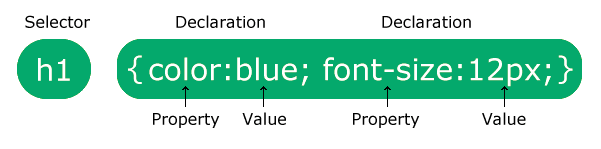
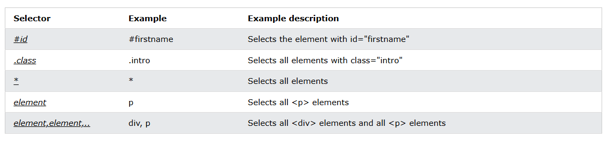

# Reference From
Document from: [Doc](https://www.w3schools.com/CSS/default.asp) 
Document from: [Mikelopster](https://youtu.be/KCYxFXIAn_4?si=SOL-E_LZ-FCaFnKX) 

## 1.กลุ่มการจัดตำแหน่งและเลย์เอาต์ (Layout and Positioning)
การจัดตำแหน่ง (Positioning):
* position: ใช้ในการกำหนดการจัดต าแหน่งขององค์ประกอบ เช่น static, relative, absolute, fixed, และ sticky
การจัดเลย์เอาต์:
* display: ใช้ในการกำหนดลักษณะการแสดงผลขององค์ประกอบ เช่น block, inline,inline-block, flex, grid
* float: ใช้ในการท าให้องค์ประกอบลอยอยู่ทางซ้ายหรือขวา
* clear: ใช้ในการเคลียร์การลอยขององค์ประกอบ
* flex และ grid: ฟีเจอร์ใหม่ที่ช่วยในการจัดการการวางเลย์เอาต์ที่ซับซ้อน

## 2. กลุ่มการจัดรูปแบบข้อความ (Text Formatting)
การตั้งค่าฟอนต์:
* font-family: ใช้ในการกำหนดฟอนต์ของข้อความ
* font-size: กำหนดขนาดตัวอักษร
* font-weight: กำหนดความหนาของตัวอักษร (bold, normal)
* font-style: กำหนดสไตล์ของฟอนต์ (normal, italic)
การจัดรูปแบบข้อความ:
* text-align: กำหนดการจัดต าแหน่งของข้อความ (left, right, center, justify)
* text-transform: ใช้ในการปรับแต่งการแสดงผลของตัวอักษร (uppercase, lowercase)
* text-decoration: กำหนดลักษณะการตกแต่งข้อความ เช่น ขีดเส้นใต้ (underline), ขีด
กลาง (line-through)

## 3. กลุ่มการจัดการสีและพื้นหลัง (Color and Background)
การจัดการสี:
* color: กำหนดสีของข้อความ
* background-color: กำหนดสีพื้นหลัง
* border-color: กำหนดสีของขอบ
การจัดการพื้นหลัง:
* background-image: ใช้ในการใส่ภาพพื้นหลัง
* background-position: กำหนดตำแหน่งของภาพพื้นหลัง
* background-size: กำหนดขนาดของภาพพื้นหลัง
* background-repeat: กำหนดการทำซ้ำภาพพื้นหลัง

## 4. กลุ่มการเพิ่มกรอบและการจัดระยะห่าง (Borders and Spacing)
กรอบ (Borders):
* border: กำหนดกรอบรอบองค์ประกอบ เช่น ขนาด, รูปแบบ, และสีของกรอบ
* border-radius: ใช้ในการสร้างมุมโค้งให้กับกรอบ
ช่องว่าง (Spacing):
* margin: กำหนดช่องว่างภายนอกองค์ประกอบ
* padding: กำหนดช่องว่างภายในองค์ประกอบ

## 5. กลุ่มการใช้งานกราฟิก (Graphics)
การจัดการภาพและกราฟิก:
* box-shadow: ใช้ในการเพิ่มเงาให้กับองค์ประกอบ
* text-shadow: ใช้ในการเพิ่มเงาให้กับข้อความ
* linear-gradient, radial-gradient: ใช้ในการสร้างการไล่ระดับสีเป็นพื้นหลัง

## 6. กลุ่มการแอนิเมชันและการเปลี่ยนแปลง (Animations and Transitions)
การเปลี่ยนแปลง (Transitions):
* transition: ใช้ในการเปลี่ยนแปลงสไตล์ขององค์ประกอบเมื่อมีการโต้ตอบ เช่น การ
เปลี่ยนสีเมื่อเลื่อนเมาส์
* transform ใช้ในการหมุนหรือปรับแต่งการแสดงผลขององค์ประกอบ
แอนิเมชัน (Animations):
* @keyframes: กำหนดลำดับของแอนิเมชัน
* animation: ใช้ในการกำหนดลักษณะของแอนิเมชัน เช่น ความยาวเวลา, การทำงานที่
เสร็จสมบูรณ์, และการเล่นซ้ำ

## CSS Syntax
Syntax ของ CSS3 มีรูปแบบที่ใช้ในการกำหนดสไตล์ขององค์ประกอบใน HTML โดยทั่วไปจะประกอบไปด้วย 3 ส่วนหลัก ๆ  ได้แก่ ตัวเลือก (Selector), คุณสมบัติ (Property), และ ค่า (Value) 
 
รูปแบบทั่วไปของ CSS
<pre>
p {
  color: red;
  text-align: center;
}
</pre>
1. P (ตัวเลือก): คือชื่อขององค์ประกอบหรือกลุ่มขององค์ประกอบที่คุณต้องการจะปรับแต่ง
สไตล์ เช่น body, h1, .class-name, #id-name
2. color,text-align (คุณสมบัติ): คือคุณสมบัติที่คุณต้องการจะเปลี่ยนแปลง เช่น color, font-size,
margin, background-color
3. red,center (ค่า): คือค่าที่คุณต้องการจะก าหนดให้กับคุณสมบัตินั้น ๆ เช่น red, 16px, 20px, #ffffff

### Three Ways to Insert CSS
* <b>Inline CSS (การใช้ CSS ภายในแท็ก HTML โดยตรงใน `<body>`) </b> 
* <b>Internal CSS (การใช้CSS ภายในแท็ก `<style>` ใน `<head>`) </b> 
* <b>External CSS (การใช้ไฟล์ CSS ภายนอก ใน `<head>` )</b>:`<link rel="stylesheet" type="text/css" href="styles.css">`

